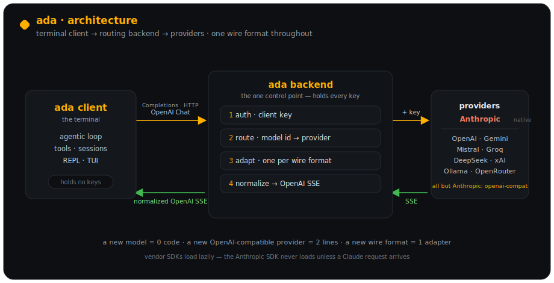

# ada

A coding agent built from zero — a terminal client in the spirit of pi / Codex / Cursor,
backed by a **Cursor-style routing backend** that holds every provider key and speaks one wire
format to the client.



The client talks **only** OpenAI Chat Completions to the backend. The backend routes each request
to the right provider by model id and normalizes every provider back to that one format — so a new
model is **zero code**, and a new OpenAI-compatible provider is **two lines**.

---

## Features

- **Agentic loop** — streams, calls tools, feeds results back, repeats until done.
- **Tools** — `read_file`, `write_file`, `edit_file` (exact-match), `bash`, `ls`, `grep`, `glob`.
- **Two front-ends** — a classic readline REPL and an inline **TUI** (`--tui`) with a live "thinking"
  spinner and Claude-style turn markers.
- **Plan mode**, **todos**, **checkpoint/undo** (revert the agent's edits), **protected paths** +
  destructive-command confirmation, and **subagents** (`spawn_agent`).
- **Sessions** — every turn is persisted; `--continue` / `--resume` to pick up where you left off.
- **Context compaction** — summarizes old turns automatically as context grows.
- **Sign in with GitHub or Google** (RFC 8628 device flow) — zero client config.
- **Extensible** — extensions (tools + hooks + commands), prompt templates, skills, and MCP servers.
- **No build step** — TypeScript run through `tsx`.

## Providers

The backend proxies any OpenAI-compatible upstream and translates the one that isn't (Anthropic):

| Provider | Models | Key env var |
|---|---|---|
| OpenAI | `gpt-*`, `o*` | `OPENAI_API_KEY` |
| Anthropic | `claude-*` | `ANTHROPIC_API_KEY` |
| Google Gemini | `gemini-*` | `GEMINI_API_KEY` |
| Mistral | `mistral-*` | `MISTRAL_API_KEY` |
| Groq | — | `GROQ_API_KEY` |
| DeepSeek | `deepseek-*` | `DEEPSEEK_API_KEY` |
| Together | — | `TOGETHER_API_KEY` |
| xAI (Grok) | `grok-*` | `XAI_API_KEY` |
| DashScope (Qwen) | — | `DASHSCOPE_API_KEY` |
| OpenRouter | everything else | `OPENROUTER_API_KEY` |
| **Ollama (local)** | `name:tag` (e.g. `qwen2.5-coder:latest`) | *keyless* |

Routing: a model id containing `:` → local Ollama; otherwise by prefix; an explicit `provider`
field always wins. Set only the keys you have — the rest stay dormant (vendor SDKs load lazily).

---

## Install

Requires **Node ≥ 18**.

```bash
git clone https://github.com/black141312/ada.git
cd ada
npm install
npm link          # puts `ada` and `ada-server` on your PATH
```

`npm link` makes `ada` a global command. (Prefer not to link? Use `npm start` from the repo, or
`npm install -g .`.) To remove it later: `npm unlink -g ada`.

## Quickstart

ada is two processes: a **backend** (holds keys, routes) and the **`ada`** client.

**Option A — local, no keys (Ollama):**

```bash
# terminal 1: backend
ada-server                              # → http://localhost:8787

# terminal 2: the agent
ada                                     # pick a local model and chat
```

**Option B — a cloud provider:**

```bash
# terminal 1
export ANTHROPIC_API_KEY=sk-ant-...     # and/or OPENAI_API_KEY, GEMINI_API_KEY, …
ada-server

# terminal 2
ada --model claude-opus-4-8
```

Windows PowerShell: `$env:ANTHROPIC_API_KEY="sk-ant-..."`.

---

## Using `ada`

```bash
ada                      # interactive; pick a model on first run
ada --tui                # inline TUI front-end
ada --model <id>         # start on a specific model
ada --list-models        # everything your keys can reach (via the backend)
ada --continue           # resume the most recent session
ada --resume             # pick a session to resume
ada --yolo               # auto-approve tool calls (skip prompts)
ada -p "fix the build"   # one-shot: print the answer and exit
```

**Slash commands** (in a session): `/model [id]` · `/models` · `/reasoning low|medium|high|off` ·
`/plan` · `/run` · `/todos` · `/undo` · `/fork` · `/tree` · `/rewind` · `/compact` · `/context` ·
`/cost` · `/image <path>` · `/paste` · `/login` · `/logout` · `/exit`.

**Sign in** (optional — identifies you to the backend): run `/login`, choose GitHub or Google, and
enter the device code in your browser. The token is stored locally and sent as your client key.

## Skills

ada ships with built-in **skills** — specialized instructions the model pulls in only when a task
needs them (progressive disclosure). The model loads one via the `use_skill` tool:

| Skill | What it does |
|---|---|
| `commit` | Stage changes and write a clean Conventional Commits message |
| `code-review` | Review the current diff for correctness bugs + quality issues |
| `write-tests` | Find the test runner, add focused cases, run them, report |
| `open-pr` | Push the branch and open a GitHub PR (`gh`) with a structured body |

Add your own as `SKILL.md` files under `.ada/skills/<name>/` (project) or `~/.ada/skills/<name>/`
(global) — a `---\ndescription: …\n---` front-matter line is all that's required. Project skills
override global, which override the built-ins.

## Configuration

**Client** (`ada`):

| Env var | Default | Purpose |
|---|---|---|
| `ADA_BACKEND_URL` | `http://localhost:8787/v1` | Where the backend lives |
| `ADA_CLIENT_KEY` | stored login token, else `dev` | Bearer sent to the backend |
| `ADA_MODEL` | — | Default model id |
| `ADA_COMPACT_AT` | `100000` | Token estimate that triggers compaction |
| `ADA_AUTO_APPROVE` | — | `1` ⇒ behave like `--yolo` |
| `NO_COLOR` / `ADA_THEME` | — | Disable color / theme overrides |

**Backend** (`ada-server`):

| Env var | Default | Purpose |
|---|---|---|
| `ADA_PORT` | `8787` | Listen port |
| `ADA_CLIENT_KEYS` | *(unset = dev/no-auth)* | Comma-separated allowed client keys |
| `ADA_REQUIRE_LOGIN` / `ADA_ALLOWED_USERS` | — | Gate access to verified GitHub/Google users |
| `OLLAMA_BASE_URL` | `http://localhost:11434/v1` | Local Ollama endpoint |
| *(provider keys)* | — | See the [Providers](#providers) table |

---

## Develop

```bash
npm run typecheck        # tsc --noEmit
npm run selfcheck        # offline checks (tools, sessions, routing, parsers, TUI)
npm start                # run the client from source
npm run server           # run the backend from source
```

See **[docs/architecture.md](docs/architecture.md)** for the design (adapters, routing, request flow,
file layout) and **[MISSING.md](MISSING.md)** for the feature checklist.

## License

[MIT](LICENSE) © 2026 Aditya
