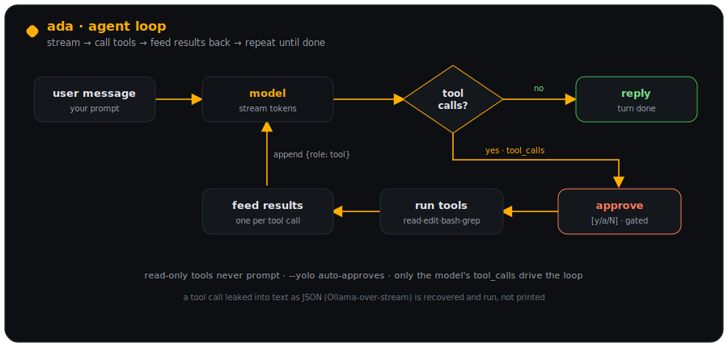
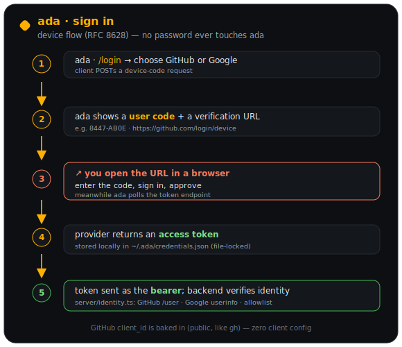

# Architecture

ada is two programs in one repo: a thin **client** (the coding agent) and a **backend** (the
router that holds provider keys). They communicate in one wire format — OpenAI Chat Completions.


```
 ada (client)                    ada backend                         upstream providers
 ────────────                    ───────────                         ──────────────────
 agentic loop  ──── HTTP  ───▶   auth (client key)
 tools                           router: model id → provider
 sessions                        adapter: provider → wire format ──▶  Anthropic / OpenAI / …
 approval/TUI   ◀── SSE  ────    normalize back to OpenAI SSE
```

Why split it: the backend is the **one control point**. Provider keys, auth, rate limits, and
billing all belong in one place; the client carries only an ada client key. Same shape as Cursor.

## Request flow

1. The client sends an OpenAI-format chat request (model, messages, tools) to `ADA_BACKEND_URL`
   with its client key as the bearer.
2. The backend authenticates the key (`ADA_CLIENT_KEYS`, or open in dev mode), then `router.ts`
   maps the model id → a provider.
3. The matching **adapter** calls the upstream with the server-held provider key — a pass-through
   for OpenAI-compatible providers, a translation for Anthropic.
4. The backend streams normalized OpenAI SSE chunks back; the client renders text and runs tool
   calls, appending one `{role:"tool", tool_call_id, content}` per call and looping.

## The agent loop



Each turn streams the model's reply; if it contains tool calls, gated ones go through the
**permission mode**, the tools run, and one `{role:"tool", tool_call_id, content}` per call is
appended before control returns to the model — looping until the model stops calling tools.

**Permission modes** (`/ask` · `/plan` · `/auto`, or `/mode` to cycle; shown in the prompt):

- **ask** (default) — each gated tool shows a plain-words prompt ("ada wants to run a shell command…")
  and one key: `[y]es` · `[a]uto` · `[p]lan` · `[n]o`. Destructive `bash` always confirms.
- **plan** — read-only: ada plans but won't edit; `/run` approves and executes.
- **auto** — runs tools without asking (still confirms destructive `bash`). `--yolo` starts here.

**Skills.** ~285 bundled `SKILL.md` instructions load only on demand. A lexical router
(`client/skill-router.ts`) ranks every request; on a confident, name-exact match ada **auto-applies**
the skill (injects its procedure, announced `↳ skill: <name>`), otherwise it suggests them. The model
can also `list_skills` / `find_skill` / `use_skill`. See [orchestration.md](orchestration.md) for the
strategies (`react`/`plan`/`multi`/`toolsmith`) layered on the same loop.

**Programmatic surfaces.** Beyond the REPL/TUI, the same agent drives an HTTP API (`ada serve`), a
typed SDK, an ACP editor bridge (`ada acp`), and read-only session sharing (`ada share`) — see
[integrations.md](integrations.md). And it can run **SWE-bench Verified** via [bench/](../bench/).

## Sign in (device flow)



GitHub/Google login uses the OAuth 2.0 device authorization grant (RFC 8628) — no password ever
reaches ada. The token is stored locally and sent as the bearer; the backend verifies identity in
`server/identity.ts`. The GitHub `client_id` is baked in (public, like `gh`), so the client needs
zero config.

## One adapter per wire format

The key design decision: adapters are keyed by **wire format**, not by provider or model.

- Most providers speak the OpenAI format and share **`openai-compat.ts`** (a pass-through that just
  swaps in the right base URL + key).
- Only a divergent format gets its own adapter — **`anthropic.ts`** translates OpenAI ⇄ Anthropic
  Messages and re-emits Anthropic events as OpenAI SSE.

Consequences:

| Change | Cost |
|---|---|
| A new model | **0 code** (routing is by id) |
| A new OpenAI-compatible provider | **2 lines** in `config.ts` (base URL + key env) |
| A brand-new wire format | **1 adapter** + one line in `registry.ts` |

Vendor SDKs load **lazily** (pi-style): a `type`-only import plus a dynamic `import()`, so e.g.
`@anthropic-ai/sdk` never loads unless a Claude request actually arrives.

## Routing

`router.ts` maps a model id to a provider:

- a model id containing `:` (e.g. `qwen2.5-coder:latest`) → local **Ollama**;
- otherwise by prefix (`gpt*`/`o*` → openai, `claude*` → anthropic, `gemini*` → google,
  `mistral*` → mistral, `grok*` → xai, …);
- an explicit `provider` field on the request always wins;
- anything unmatched falls through to **OpenRouter**.

## Context compaction

The client estimates context size (≈ chars / 4) and, when it crosses `ADA_COMPACT_AT` (default
100k) or a request overflows, summarizes older turns into one compact summary and keeps the recent
ones. `/compact` forces it; `/context` shows the current estimate.

## Tool-call recovery

Some providers (notably **Ollama over a streaming connection**) fail to parse a model's tool call
into the structured `tool_calls` field and leak it into the text as raw JSON. The client detects a
reply that *is* a JSON tool call (plain, ```` ```json ```` fenced, or `<tool_call>`-wrapped) for a
real tool and runs it instead of printing the JSON. Hallucinated tools (no such tool) are left as
text. See `parseTextToolCalls` in `client/agent.ts`.

## File layout

```
bin/
  ada.mjs             launcher: register tsx loader → run client/cli.ts
  ada-server.mjs      launcher: register tsx loader → run server/index.ts

src/
  shared/
    types.ts          provider/model types shared by client and server

  server/             the routing backend                 (ada-server | npm run server)
    index.ts          HTTP entry: auth → route → dispatch to an adapter (+ /v1/models, /v1/whoami)
    config.ts         providers, base URLs, key env vars, port, client-key auth
    router.ts         model id → provider
    sse.ts            Server-Sent Events helpers
    identity.ts       verify GitHub/Google tokens; allowlist
    oauth.ts          RFC 8628 device-flow login (built-in GitHub client id)
    credentials.ts    local credential store
    providers/
      adapter.ts      the Adapter interface               ← one adapter per WIRE FORMAT
      registry.ts     provider → adapter map
      openai-compat.ts pass-through OpenAI-compatible adapter
      anthropic.ts    native Anthropic adapter (lazy @anthropic-ai/sdk)

  client/             the terminal agent                  (ada | npm start)
    cli.ts            REPL: flags, model picker, slash commands, ask/plan/auto modes + approval
    agent.ts          the agentic loop (stream → tool calls → feed back → repeat) + orchestrators
    tools.ts          read_file/write_file/edit_file · apply_patch · bash (PTY) · ls/glob/grep (rg)
                      · web_fetch/web_search · lsp_diagnostics · ask_user; protected paths;
                      destructive detection; trust-gated auto-format
    tui.ts            inline TUI engine (composer, spinner, user bar)
    tui-mode.ts       the TUI loop
    session.ts        append-only JSONL session store (.ada/sessions/)
    compaction.ts     context summarization
    checkpoint.ts · snapshot.ts   undo (revert edits) · whole-tree git snapshot/restore
    skills.ts · skill-router.ts   skills + the relevance router (auto-apply)
    mcp.ts · prompts.ts · background.ts · models-dev.ts · lsp.ts   connectors, templates,
                      background jobs, models.dev catalog, LSP client
    todos.ts · hooks.ts · extensions.ts   tasks; extension hooks + tools + commands
    settings.ts · platform.ts · render.ts · image.ts · telemetry.ts · pkg.ts

  sdk/index.ts        typed client for the HTTP API (`ada serve`)
  selfcheck.ts        offline checks (tools, sessions, routing, parsers, TUI, classifiers)

bench/
  swebench.mjs        SWE-bench Verified prediction generator (scored by the official harness)
```

## No build step

Everything runs through `tsx` — TypeScript with no compile. The `bin/*.mjs` launchers register the
tsx ESM loader in-process, then import the relevant `.ts` entrypoint (which self-runs). `tsx` is a
runtime dependency so the global `ada` command works after `npx ada-agent`, `npm install -g ada-agent`,
or `npm link` from a clone. (`node-pty` is the one native dep, so a C toolchain is needed at install.)
